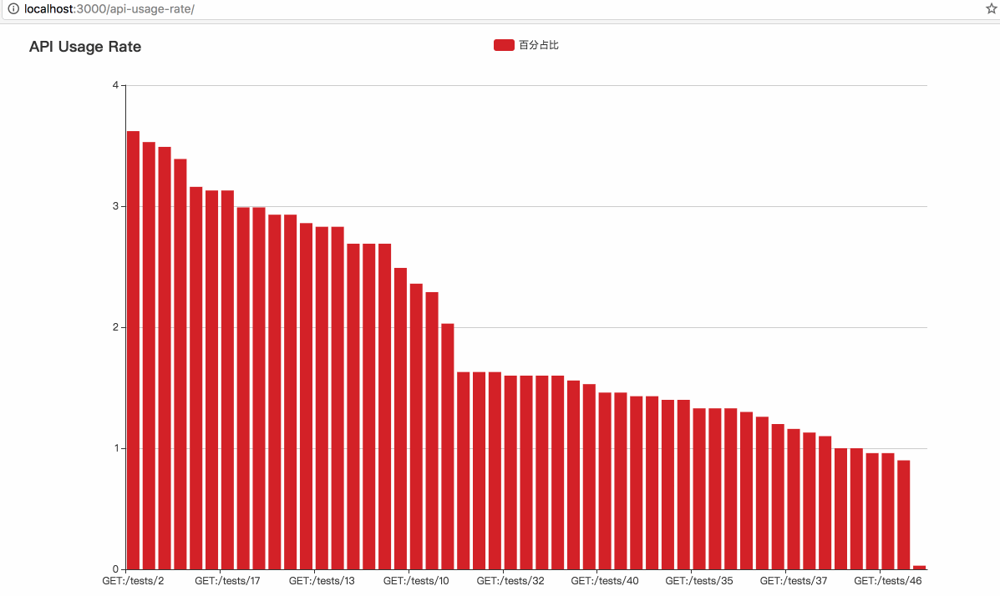

# api-usage-rate
[](https://travis-ci.org/Maples7/api-usage-rate)
[](https://coveralls.io/github/Maples7/api-usage-rate?branch=master)
[](https://badge.fury.io/js/api-usage-rate)           
[](https://nodei.co/npm/api-usage-rate/)
[](https://nodei.co/npm/api-usage-rate/)

An Express-based middleware to trace usage rate of APIs and show them in real time with great visualization tools.



## Why?
I definitely know that you can get the api usage rate of your application through logs, even with some awesome tools such as [ELK](https://www.elastic.co/), but they are too heavy and very high resource-consuming.

So I make this tiny tool. No more, no less, just clearly show you the usage rate of APIs. 

With these data, you can 
- make your application better by listening to what your users really like
- remove old code of your app promptly and keep your code is always brandly new

## Usage
### Installation
`yarn add api-usage-rate` or `npm install api-usage-rate --save`

### Requirement
- a running redis service

### Example
Talk is cheap, show you the code:
```js
const path = require('path');
const express = require('express');
const routes = require('express-mount-routes'); 
const apiRate = new (require('api-usage-rate'))();

const app = express();
// moute a middleware who records data of api usage rate in redis
app.use(apiRate.record());
// see https://github.com/Maples7/express-mount-routes
routes(app, path.join(__dirname, 'controllers'));
// moute routes for Express:
// - /api-usage-rate: a static page to visualize api usage rate
// - /api-data: JSON data about hits number of APIs
apiRate.mouteRoutes(app);

app.listen(3000, () => {
  console.log('Example app listening on port 3000!');
});
```
Notes:
- `app.use(apiRate.record());`: this middleware would record every hits of APIs in your redis. Key `api-usage-rate` refers a zset who holds number of hits in field `${req.method}:${req.path}` and key `api-hits-counter` holds sum of hits of all APIs. You can check your redis.
- `apiRate.mouteRoutes(app);`: like the comment in example code says, routes `/api-usage-rate` and `/api-data` can be used with your browser once your app is launched.

### API
1. constructor
```js
// all params are optional
const apiRate = new (require('api-usage-rate'))({
  connectRedis, // Info required to connect to redis, Object or String, default to `undefined`, see https://github.com/luin/ioredis/blob/master/API.md#new-redisport-host-options for more instruction
  ignorePathes, // Array of RegExp, any req.path tested true with RegExp in the array would be ignore, default to `[/^\/api-data*/, /^\/api-usage-rate*/, /js$/, /css$/]`
  flushdb, // whether run `flushdb` while a new instance of class ApiUsageRate is generated, this would flush all api usage data stored in some db of redis, default to false
});
```

2. `apiRate.record()` takes no arguments.
3. `apiRate.mouteRoutes(app)`: `app = express()`.

You are welcomed to review _test.js_ and _test_page.js_ in this project for more infomation of usage.

## LICENSE
[MIT](LICENSE)
